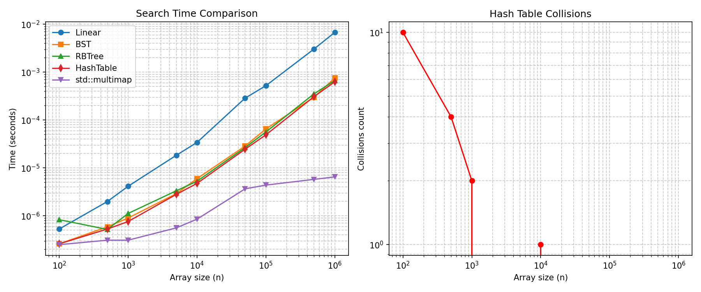

# Лабораторная работа №2: Тестирование и сравнение алгоритмов сортировки для записей об абитуриентах (вариант 16)

## Документация Doxygen

## Исходный код
[GitHub](https://github.com/mlianskaya/programming_techniques_lab2.git)  

## Графики

## Описание
В работе реализованы методы поиска всех вхождений по ключу (ФИО):  
- линейный поиск,  
- бинарное дерево поиска (BST),  
- красно-чёрное дерево (RBT),  
- хэш-таблица (с методом цепочек и улучшенной структурой корзины «ключ → вектор значений»),  
- `std::multimap` (эталон).  

Объект поиска – структура «Абитуриент» (ФИО, факультет, специальность, сумма баллов).  
Ключи не уникальны – допускаются дубликаты.  

Проведены замеры времени для массивов от 100 до 1 000 000 элементов.  
Для хэш-таблицы подсчитано количество коллизий (конфликтов разных ключей).  
Графики результатов приведены в отчёте.
